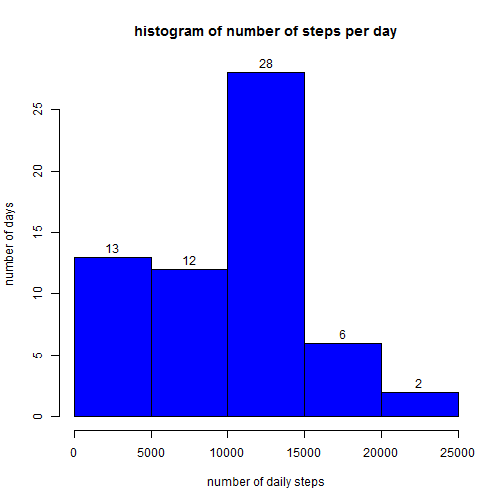
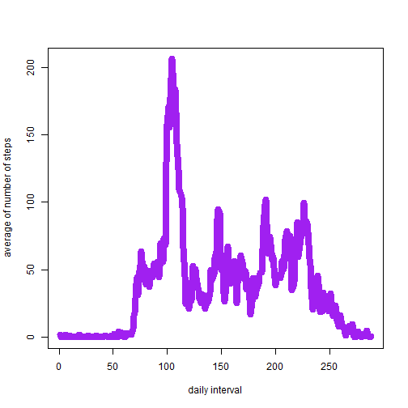
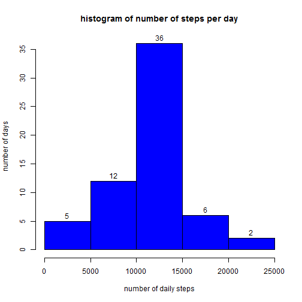
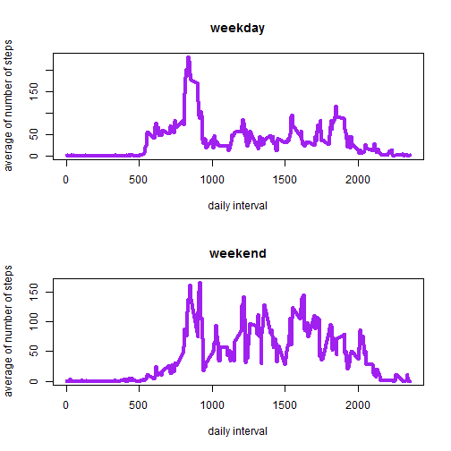

##Libraries and initial directory

library(lubridate)

##General options

```r
opts_chunk$set(echo=TRUE)
```

## Loading and preprocessing the data


```r
data<-read.csv("activity.csv")
data$date<-as.Date(data$date)
```

## What is mean total number of steps taken per day?


```r
sum_steps_d<-sapply(split(data,as.factor(data$date)),function(x) sum(x$steps,na.rm=T))
hist(sum_steps_d,
	xlab="number of daily steps",
	ylab="number of days",
	labels=T,
	main="histogram of number of steps per day",
	col="blue")
```

 

```r
mean_steps<-mean(sum_steps_d)
median_steps<-median(sum_steps_d)
cat("mean of the total number of steps taken per day:\n");mean_steps
```

```
## mean of the total number of steps taken per day:
```

```
## [1] 9354.23
```

```r
cat("median of the total number of steps taken per day:\n");median_steps
```

```
## median of the total number of steps taken per day:
```

```
## [1] 10395
```

## What is the average daily activity pattern?


```r
ave_steps_i<-sapply(split(data,as.factor(data$interval)),function(x) mean(x$steps,na.rm=T))
plot(x=names(ave_steps_i),y=ave_steps_i,type="l",
	xlab="daily interval",
	ylab="average of number of steps",
	col="purple",
	lwd=8)
```

 

```r
max_i<-ave_steps_i[ave_steps_i==max(ave_steps_i)]
cat("5 min interval with the maximum number of steps is:\n");names(max_i)
```

```
## 5 min interval with the maximum number of steps is:
```

```
## [1] "835"
```

```r
cat("5 min interval with the maximum number of steps is:\n");cat(names(max_i));cat("\n")
```

```
## 5 min interval with the maximum number of steps is:
```

```
## 835
```

## Imputing missing values


```r
cat("The number of NAs on each variable is the following\n");apply(data,2,function(x) sum(is.na(x)))
```

```
## The number of NAs on each variable is the following
```

```
##    steps     date interval 
##     2304        0        0
```

```r
#NA imputation
cat("NA imputation\n")
```

```
## NA imputation
```

```r
ave_steps_i<-sapply(split(data,as.factor(data$interval)),function(x) mean(x$steps,na.rm=T))
ave_steps_i<-data.frame(interval=as.integer(names(ave_steps_i)),num_steps=ave_steps_i)
data<-merge(data,ave_steps_i,by="interval")
data[is.na(data$steps),]$steps<-data[is.na(data$steps),]$num_steps
data$num_steps<-NULL
cat("The number of NAs on each variable is now\n");apply(data,2,function(x) sum(is.na(x)))
```

```
## The number of NAs on each variable is now
```

```
## interval    steps     date 
##        0        0        0
```

```r
#Recalculation of point 1 without NAs
cat("Recalculations of point 2, histogram of total number of steps per day, mean and median but now without NAs\n")
```

```
## Recalculations of point 2, histogram of total number of steps per day, mean and median but now without NAs
```

```r
sum_steps_d<-sapply(split(data,as.factor(data$date)),function(x) sum(x$steps,na.rm=T))
hist(sum_steps_d,
	xlab="number of daily steps",
	ylab="number of days",
	labels=T,
	main="histogram of number of steps per day",
	col="blue")
```

 

```r
mean_steps<-mean(sum_steps_d)
median_steps<-median(sum_steps_d)
cat("mean of the total number of steps taken per day:\n");mean_steps
```

```
## mean of the total number of steps taken per day:
```

```
## [1] 10766.19
```

```r
cat("median of the total number of steps taken per day:\n");median_steps
```

```
## median of the total number of steps taken per day:
```

```
## [1] 10766.19
```

#New values differs from the calculated on point 2.
#Number of steps per days is greater than in point 2

## Are there differences in activity patterns between weekdays and weekends?


```r
#Creation of a variable differentiation weekday and weekday

data$day_type<-"weekday"
data$day_type[weekdays(data$date)%in%weekdays(as.Date(c("2012-12-02","2012-12-01")))]<-"weekend"

#Average number of steps per interval depending on weekday/weekend
data_wd<-subset(data,day_type=="weekday");data_wd$interval<-as.factor(data_wd$interval)
data_we<-subset(data,day_type=="weekend");data_we$interval<-as.factor(data_we$interval)
ave_steps_i_wd<-sapply(split(data_wd,data_wd$interval),function(x) mean(x$steps))
ave_steps_i_we<-sapply(split(data_we,data_we$interval),function(x) mean(x$steps))

#plot
par(mfrow=c(2,1))
plot(x=names(ave_steps_i_wd),y=ave_steps_i_wd,type="l",
	xlab="daily interval",
	ylab="average of number of steps",
	col="purple",
	main="weekday",
	lwd=4)
plot(x=names(ave_steps_i_we),y=ave_steps_i_we,type="l",
	xlab="daily interval",
	ylab="average of number of steps",
	col="purple",
	main="weekend",
	lwd=4)
```

 


